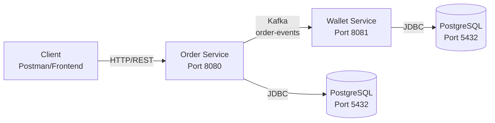

# Mini E-Commerce & E-Wallet Platform

> A production-ready microservices-based e-commerce platform built with Spring Boot, featuring Order Management and Wallet/Payment services communicating via Apache Kafka.

[](https://openjdk.org/projects/jdk/21/)
[](https://spring.io/projects/spring-boot)
[](https://www.postgresql.org/)
[](https://kafka.apache.org/)
[](https://flywaydb.org/)
[](https://spring.io/projects/spring-security)
[](https://mapstruct.org/)
[](https://projectlombok.org/)
[](https://www.docker.com/)
[](https://maven.apache.org/)
[](https://junit.org/junit5/)
[](LICENSE)

---

## 📋 Table of Contents / İçindekiler

| English | Türkçe |
|---------|--------|
| [Overview](#overview) | [Genel Bakış](#genel-bakış) |
| [Architecture](#architecture) | [Mimari](#mimari) |
| [Tech Stack](#tech-stack) | [Teknoloji Yığını](#teknoloji-yığını) |
| [Project Structure](#project-structure) | [Proje Yapısı](#proje-yapısı) |
| [Getting Started](#getting-started) | [Başlangıç](#başlangıç) |
| [API Documentation](#api-documentation) | [API Dokümantasyonu](#api-dokümantasyonu) |
| [Database Schema](#database-schema) | [Veritabanı Şeması](#veritabanı-şeması) |
| [Key Features](#key-features) | [Temel Özellikler](#temel-özellikler) |
| [Contributing](#contributing) | [Katkıda Bulunma](#katkıda-bulunma) |

---

## Overview

A robust, event-driven e-commerce platform consisting of two independent Spring Boot microservices. The Order Service handles user management, product catalog, and order processing, while the Wallet Service manages e-wallet balances and transaction history. Services communicate asynchronously via Apache Kafka using the Outbox Pattern for guaranteed message delivery.

### Key Features

- **Order Service**: User management, product catalog, order processing with stock validation
- **Wallet Service**: E-wallet balance management, top-up, transaction history
- **Event-Driven Architecture**: Kafka-based async communication with Outbox Pattern for reliability
- **Security**: JWT-based stateless authentication with role-based authorization (CUSTOMER/ADMIN)
- **Data Integrity**: Optimistic locking, idempotency guarantees, Flyway database migrations
- **Observability**: Springdoc OpenAPI (Swagger UI), structured logging, health endpoints
- **Container Ready**: Dockerized services with Docker Compose orchestration

---

## Architecture



### Communication Flow

1. **Client** → Creates order via REST API (Order Service)
2. **Order Service** → Validates stock, persists order (PENDING), writes event to Outbox table **atomically in same transaction**
3. **Outbox Relay** → Polls pending events, publishes to Kafka `order-events` topic
4. **Wallet Service** → Consumes `ORDER_CREATED` event, processes payment with idempotency check
5. **Wallet Service** → Updates balance, records transaction (DEBIT), marks order completed

---

## Tech Stack

| Category | Technology | Version | Purpose |
|----------|------------|---------|---------|
| **Language & Framework** | Java, Spring Boot | 21, 3.x | Core application framework |
| **Database** | PostgreSQL | 16 | Relational data storage |
| **DB Migration** | Flyway | Latest | Schema versioning (ddl-auto: validate) |
| **Message Queue** | Apache Kafka | 3.x | Async inter-service communication |
| **Security** | Spring Security + JWT | Latest | Stateless auth & role-based access |
| **Mapping** | MapStruct | 1.6.3 | Entity ↔ DTO conversion at compile time |
| **Validation** | Spring Validation | Latest | Request validation (@Valid) |
| **Documentation** | Springdoc OpenAPI | 2.8.9 | Swagger UI & OpenAPI 3 spec |
| **Testing** | JUnit 5, Mockito | Latest | Unit & integration testing |
| **Infrastructure** | Docker, Docker Compose | Latest | Containerization & local dev |
| **Build Tool** | Maven | Latest | Dependency management & build |

---

## Project Structure

```
e-commerce-workspace/
├── docker-compose.yml           # Infrastructure orchestration
├── .env.example                 # Environment variables template
├── order-service/               # Order Management Microservice
│   ├── src/main/java/com/ErayYalman/mini/e_commerce/and/e_wallet/platform/
│   │   ├── config/              # SecurityConfig, KafkaConfig
│   │   ├── controller/          # REST endpoints (Auth, Product, Order, User)
│   │   ├── dto/                 # Request/Response DTOs
│   │   ├── entity/              # JPA Entities (User, Product, Order, OrderItem, OutboxEvent)
│   │   ├── exception/           # Custom exceptions & GlobalExceptionHandler
│   │   ├── mapper/              # MapStruct mappers
│   │   ├── messaging/           # OutboxRelayScheduler (Kafka producer)
│   │   ├── repository/          # Spring Data JPA repositories
│   │   ├── security/            # JWT filter, token provider, UserDetailsService
│   │   └── service/             # Business logic (Auth, Product, Order, User)
│   ├── src/main/resources/
│   │   ├── application.yaml     # Configuration
│   │   └── db/migration/        # Flyway SQL migrations (V1-V5)
│   ├── pom.xml                  # Maven dependencies
│   └── Dockerfile
└── wallet-service/              # Wallet/Payment Microservice
    ├── src/main/java/com/ErayYalman/wallet_service/
    │   ├── controller/          # WalletController (health, top-up, balance)
    │   ├── entity/              # Wallet, WalletTransaction
    │   ├── service/             # WalletService (payment processing)
    │   └── messaging/           # OrderEventConsumer (Kafka listener)
    ├── src/main/resources/
    │   ├── application.yaml
    │   └── db/migration/        # Flyway SQL migrations
    ├── pom.xml
    └── Dockerfile
```

---

## Getting Started

### Prerequisites

- **Java 21+** (JDK)
- **Maven 3.9+**
- **Docker & Docker Compose**
- **PostgreSQL Client** (optional, for DB inspection)

### Environment Setup

1. **Clone the repository**
   ```bash
   git clone <repository-url>
   cd e-commerce-workspace
   ```

2. **Configure environment variables**
   ```bash
   cp .env.example .env
   # Edit .env with your values
   ```

3. **Required `.env` variables**
   ```env
   DB_USER=admin
   DB_PASSWORD=secret
   ORDER_DB_NAME=ecommerce_order_db
   WALLET_DB_NAME=ecommerce_wallet_db
   JWT_SECRET=your-super-secret-jwt-key-min-256-bits
   JWT_EXPIRATION=86400000
   ```

### Run with Docker Compose (Recommended)

```bash
# Start all services (PostgreSQL, Order Service, Wallet Service)
docker-compose up --build -d

# View logs
docker-compose logs -f order-service
docker-compose logs -f wallet-service

# Stop services
docker-compose down
```

### Run Locally (Development)

```bash
# Terminal 1: Start PostgreSQL only
docker-compose up postgres -d

# Terminal 2: Run Order Service
cd order-service
./mvnw spring-boot:run

# Terminal 3: Run Wallet Service
cd wallet-service
./mvnw spring-boot:run
```

### Verify Services

| Service | URL | Description |
|---------|-----|-------------|
| Order Service | http://localhost:8080 | Main API |
| Wallet Service | http://localhost:8081 | Wallet API |
| Swagger UI (Order) | http://localhost:8080/swagger-ui.html | API Documentation |
| Swagger UI (Wallet) | http://localhost:8081/swagger-ui.html | API Documentation |
| Health Check (Order) | http://localhost:8080/actuator/health | Service health |
| Health Check (Wallet) | http://localhost:8081/health | Service health |

---

## API Documentation

### Order Service (Port 8080)

#### Authentication
| Method | Endpoint | Access | Description |
|--------|----------|--------|-------------|
| `POST` | `/api/auth/register` | Public | Register new user |
| `POST` | `/api/auth/login` | Public | Login & get JWT token |

#### Products
| Method | Endpoint | Access | Description |
|--------|----------|--------|-------------|
| `GET` | `/api/products` | Public | List products (paginated, sortable) |
| `GET` | `/api/products/{id}` | Public | Get product details |
| `POST` | `/api/products` | ADMIN | Create product |
| `PUT` | `/api/products/{id}` | ADMIN | Update product |
| `DELETE` | `/api/products/{id}` | ADMIN | Delete product |

#### Orders
| Method | Endpoint | Access | Description |
|--------|----------|--------|-------------|
| `POST` | `/api/orders` | CUSTOMER | Create order (triggers payment) |
| `GET` | `/api/orders` | CUSTOMER | List user's orders |
| `GET` | `/api/orders/{id}` | CUSTOMER | Get order details |

#### Users
| Method | Endpoint | Access | Description |
|--------|----------|--------|-------------|
| `GET` | `/api/users/me` | Authenticated | Get current user profile |

### Wallet Service (Port 8081)

| Method | Endpoint | Access | Description |
|--------|----------|--------|-------------|
| `GET` | `/health` | Public | Health check |
| `POST` | `/api/wallets/topup` | Authenticated | Add balance to wallet |
| `GET` | `/api/wallets/me` | Authenticated | Get current wallet balance |
| `GET` | `/api/wallets/me/transactions` | Authenticated | Get transaction history |

---

## Database Schema

### Order Service Database (`ecommerce_order_db`)

```sql
-- Users
CREATE TABLE users (
    id         UUID PRIMARY KEY DEFAULT gen_random_uuid(),
    email      VARCHAR(255) UNIQUE NOT NULL,
    password   VARCHAR(255) NOT NULL,
    full_name  VARCHAR(100) NOT NULL,
    role       VARCHAR(20) NOT NULL DEFAULT 'CUSTOMER',
    created_at TIMESTAMPTZ DEFAULT NOW()
);

-- Products
CREATE TABLE products (
    id          UUID PRIMARY KEY DEFAULT gen_random_uuid(),
    name        VARCHAR(255) NOT NULL,
    description TEXT,
    price       DECIMAL(10,2) NOT NULL CHECK (price > 0),
    stock       INT NOT NULL DEFAULT 0 CHECK (stock >= 0),
    created_at  TIMESTAMPTZ DEFAULT NOW()
);

-- Orders
CREATE TABLE orders (
    id           UUID PRIMARY KEY DEFAULT gen_random_uuid(),
    user_id      UUID NOT NULL REFERENCES users(id),
    total_amount DECIMAL(10,2) NOT NULL,
    status       VARCHAR(20) NOT NULL DEFAULT 'PENDING',
    created_at   TIMESTAMPTZ DEFAULT NOW()
);

-- Order Items
CREATE TABLE order_items (
    id         UUID PRIMARY KEY DEFAULT gen_random_uuid(),
    order_id   UUID NOT NULL REFERENCES orders(id),
    product_id UUID NOT NULL REFERENCES products(id),
    quantity   INT NOT NULL CHECK (quantity > 0),
    unit_price DECIMAL(10,2) NOT NULL
);

-- Outbox Events (for reliable Kafka publishing)
CREATE TABLE outbox_events (
    id             UUID PRIMARY KEY DEFAULT gen_random_uuid(),
    aggregate_id   UUID NOT NULL,
    event_type     VARCHAR(100) NOT NULL,
    payload        JSONB NOT NULL,
    status         VARCHAR(20) NOT NULL DEFAULT 'PENDING',
    created_at     TIMESTAMPTZ DEFAULT NOW()
);
CREATE INDEX idx_outbox_pending ON outbox_events(status) WHERE status = 'PENDING';
```

### Wallet Service Database (`ecommerce_wallet_db`)

```sql
-- Wallets
CREATE TABLE wallets (
    id         UUID PRIMARY KEY DEFAULT gen_random_uuid(),
    user_id    UUID UNIQUE NOT NULL,
    balance    DECIMAL(10,2) NOT NULL DEFAULT 0 CHECK (balance >= 0),
    version    BIGINT NOT NULL DEFAULT 0,
    updated_at TIMESTAMPTZ DEFAULT NOW()
);

-- Wallet Transactions
CREATE TABLE wallet_transactions (
    id             UUID PRIMARY KEY DEFAULT gen_random_uuid(),
    wallet_id      UUID NOT NULL REFERENCES wallets(id),
    order_id       UUID,
    type           VARCHAR(10) NOT NULL,
    amount         DECIMAL(10,2) NOT NULL,
    balance_before DECIMAL(10,2) NOT NULL,
    balance_after  DECIMAL(10,2) NOT NULL,
    created_at     TIMESTAMPTZ DEFAULT NOW()
);

-- Unique constraint for idempotency (prevent double charge)
CREATE UNIQUE INDEX idx_wallet_tx_order ON wallet_transactions(order_id)
    WHERE order_id IS NOT NULL AND type = 'DEBIT';
```

---

## Key Features

| Feature | Implementation |
|---------|----------------|
| **Reliable Messaging** | Outbox Pattern with scheduled relay ensures zero message loss |
| **Idempotency** | Unique constraint on `order_id` prevents duplicate payment processing |
| **Concurrency Control** | Optimistic locking (`@Version`) on wallet balance updates |
| **Schema Management** | Flyway migrations with `ddl-auto: validate` - no auto-DDL |
| **API Contract** | DTO pattern with MapStruct - entities never exposed |
| **Error Handling** | Global `@RestControllerAdvice` with structured error responses |
| **Security** | Stateless JWT, BCrypt password encoding, role-based access control |
| **Observability** | Swagger UI, actuator health endpoints, formatted SQL logging |

---

## Design Decisions

| Decision | Rationale |
|----------|-----------|
| **Flyway + `ddl-auto: validate`** | Prevents schema drift; migrations are version-controlled and reviewable |
| **DTO Pattern** | Decouples API contract from database schema; enables backward compatibility |
| **Outbox Pattern** | Guarantees event publishing even during Kafka outages; no dual-write problem |
| **Optimistic Locking** | Handles concurrent wallet operations without distributed locks |
| **Idempotency Keys** | Kafka redelivery safety; exactly-once semantics for payments |
| **Global Exception Handler** | Centralized error responses; clean controller logic |
| **MapStruct** | Compile-time mapping; zero reflection overhead, type-safe |

---

## Contributing

1. Fork the repository
2. Create a feature branch (`git checkout -b feature/amazing-feature`)
3. Commit your changes (`git commit -m 'Add amazing feature'`)
4. Push to the branch (`git push origin feature/amazing-feature`)
5. Open a Pull Request

---

## License

This project is licensed under the MIT License - see the [LICENSE](LICENSE) file for details.

---

## Author

**Eray Yalman** — 2026

---

# Mini E-Ticaret ve E-Cüzdan Platformu

> Spring Boot ile geliştirilmiş, üretime hazır, mikroservis tabanlı bir e-ticaret platformu. Sipariş Yönetimi ve Cüzdan/Ödeme servisleri Apache Kafka üzerinden asenkron iletişim kurar.

[](https://openjdk.org/projects/jdk/21/)
[](https://spring.io/projects/spring-boot)
[](https://www.postgresql.org/)
[](https://kafka.apache.org/)
[](https://flywaydb.org/)
[](https://spring.io/projects/spring-security)
[](https://mapstruct.org/)
[](https://projectlombok.org/)
[](https://www.docker.com/)
[](https://maven.apache.org/)
[](https://junit.org/junit5/)
[](LICENSE)

---

## Genel Bakış

İki bağımsız Spring Boot mikroservisinden oluşan, sağlam ve event-driven bir e-ticaret platformu. Order Service kullanıcı yönetimi, ürün kataloğu ve sipariş işlemeyi; Wallet Service e-cüzdan bakiye yönetimi ve işlem geçmişini üstlenir. Servisler, Outbox Pattern kullanılarak garantili mesaj teslimi ile Apache Kafka üzerinden asenkron haberleşir.

### Temel Özellikler

- **Order Service**: Kullanıcı yönetimi, ürün kataloğu, stok doğrulamalı sipariş işleme
- **Wallet Service**: E-cüzdan bakiye yönetimi, bakiye yükleme, işlem geçmişi
- **Event-Driven Mimari**: Outbox Pattern ile güvenilir Kafka tabanlı asenkron iletişim
- **Güvenlik**: JWT tabanlı stateless kimlik doğrulama, rol bazlı yetkilendirme (CUSTOMER/ADMIN)
- **Veri Bütünlüğü**: Optimistic locking, idempotency garantisi, Flyway veritabanı migrasyonları
- **Gözlemlenebilirlik**: Springdoc OpenAPI (Swagger UI), yapılandırılmış loglama, health endpoint'leri
- **Container Hazır**: Dockerize edilmiş servisler, Docker Compose orkestrasyonu

---

## Mimari


### İletişim Akışı

1. **Client** → REST API ile sipariş oluşturur (Order Service)
2. **Order Service** → Stok kontrolü yapar, siparişi kaydeder (PENDING), **aynı transaction içinde** Outbox tablosuna event yazar
3. **Outbox Relay** → Bekleyen event'leri tarar, Kafka `order-events` topic'ine yayınlar
4. **Wallet Service** → `ORDER_CREATED` event'ini tüketir, idempotency kontrolü ile ödemeyi işler
5. **Wallet Service** → Bakiyeyi günceller, işlem kaydeder (DEBIT), siparişi tamamlanmış olarak işaretler

---

## Teknoloji Yığını

| Kategori | Teknoloji | Versiyon | Amaç |
|----------|-----------|----------|------|
| **Dil & Çatı** | Java, Spring Boot | 21, 3.x | Çekirdek uygulama çatıları |
| **Veritabanı** | PostgreSQL | 16 | İlişkisel veri depolama |
| **DB Migrasyon** | Flyway | Latest | Şema versiyonlama (ddl-auto: validate) |
| **Mesaj Kuyruğu** | Apache Kafka | 3.x | Servisler arası asenkron iletişim |
| **Güvenlik** | Spring Security + JWT | Latest | Stateless auth & rol bazlı erişim |
| **Mapping** | MapStruct | 1.6.3 | Derleme zamanında Entity ↔ DTO dönüşümü |
| **Validation** | Spring Validation | Latest | İstek doğrulama (@Valid) |
| **Dokümantasyon** | Springdoc OpenAPI | 2.8.9 | Swagger UI & OpenAPI 3 spec |
| **Test** | JUnit 5, Mockito | Latest | Birim ve entegrasyon testleri |
| **Altyapı** | Docker, Docker Compose | Latest | Containerization & yerel geliştirme |
| **Build Tool** | Maven | Latest | Bağımlılık yönetimi & build |

---

## Proje Yapısı

```
e-commerce-workspace/
├── docker-compose.yml           # Altyapı orkestrasyonu
├── .env.example                 # Ortam değişkenleri şablonu
├── order-service/               # Sipariş Yönetimi Mikroservisi
│   ├── src/main/java/com/ErayYalman/mini/e_commerce/and/e_wallet/platform/
│   │   ├── config/              # SecurityConfig, KafkaConfig
│   │   ├── controller/          # REST endpoint'leri (Auth, Product, Order, User)
│   │   ├── dto/                 # Request/Response DTO'ları
│   │   ├── entity/              # JPA Entity'leri (User, Product, Order, OrderItem, OutboxEvent)
│   │   ├── exception/           # Özel exception'lar & GlobalExceptionHandler
│   │   ├── mapper/              # MapStruct mapper'ları
│   │   ├── messaging/           # OutboxRelayScheduler (Kafka producer)
│   │   ├── repository/          # Spring Data JPA repository'ler
│   │   ├── security/            # JWT filter, token provider, UserDetailsService
│   │   └── service/             # İş mantığı (Auth, Product, Order, User)
│   ├── src/main/resources/
│   │   ├── application.yaml     # Konfigürasyon
│   │   └── db/migration/        # Flyway SQL migrasyonları (V1-V5)
│   ├── pom.xml                  # Maven bağımlılıkları
│   └── Dockerfile
└── wallet-service/              # Cüzdan/Ödeme Mikroservisi
    ├── src/main/java/com/ErayYalman/wallet_service/
    │   ├── controller/          # WalletController (health, top-up, balance)
    │   ├── entity/              # Wallet, WalletTransaction
    │   ├── service/             # WalletService (ödeme işleme)
    │   └── messaging/           # OrderEventConsumer (Kafka listener)
    ├── src/main/resources/
    │   ├── application.yaml
    │   └── db/migration/        # Flyway SQL migrasyonları
    ├── pom.xml
    └── Dockerfile
```

---

## Başlangıç

### Ön Koşullar

- **Java 21+** (JDK)
- **Maven 3.9+**
- **Docker & Docker Compose**
- **PostgreSQL Client** (isteğe bağlı, DB incelemesi için)

### Ortam Kurulumu

1. **Repository'yi klonlayın**
   ```bash
   git clone <repository-url>
   cd e-commerce-workspace
   ```

2. **Ortam değişkenlerini yapılandırın**
   ```bash
   cp .env.example .env
   # .env dosyasını kendi değerlerinizle düzenleyin
   ```

3. **Gerekli `.env` değişkenleri**
   ```env
   DB_USER=admin
   DB_PASSWORD=secret
   ORDER_DB_NAME=ecommerce_order_db
   WALLET_DB_NAME=ecommerce_wallet_db
   JWT_SECRET=your-super-secret-jwt-key-min-256-bits
   JWT_EXPIRATION=86400000
   ```

### Docker Compose ile Çalıştırma (Önerilen)

```bash
# Tüm servisleri başlat (PostgreSQL, Order Service, Wallet Service)
docker-compose up --build -d

# Logları izle
docker-compose logs -f order-service
docker-compose logs -f wallet-service

# Servisleri durdur
docker-compose down
```

### Yerel Geliştirme Modunda Çalıştırma

```bash
# Terminal 1: Sadece PostgreSQL'i başlat
docker-compose up postgres -d

# Terminal 2: Order Service'i çalıştır
cd order-service
./mvnw spring-boot:run

# Terminal 3: Wallet Service'i çalıştır
cd wallet-service
./mvnw spring-boot:run
```

### Servisleri Doğrulama

| Servis | URL | Açıklama |
|--------|-----|----------|
| Order Service | http://localhost:8080 | Ana API |
| Wallet Service | http://localhost:8081 | Cüzdan API |
| Swagger UI (Order) | http://localhost:8080/swagger-ui.html | API Dokümantasyonu |
| Swagger UI (Wallet) | http://localhost:8081/swagger-ui.html | API Dokümantasyonu |
| Health Check (Order) | http://localhost:8080/actuator/health | Servis sağlığı |
| Health Check (Wallet) | http://localhost:8081/health | Servis sağlığı |

---

## API Dokümantasyonu

### Order Service (Port 8080)

#### Kimlik Doğrulama
| Method | Endpoint | Erişim | Açıklama |
|--------|----------|--------|----------|
| `POST` | `/api/auth/register` | Public | Yeni kullanıcı kaydı |
| `POST` | `/api/auth/login` | Public | Giriş & JWT token alma |

#### Ürünler
| Method | Endpoint | Erişim | Açıklama |
|--------|----------|--------|----------|
| `GET` | `/api/products` | Public | Ürünleri listele (sayfalı, sıralanabilir) |
| `GET` | `/api/products/{id}` | Public | Ürün detayını getir |
| `POST` | `/api/products` | ADMIN | Ürün oluştur |
| `PUT` | `/api/products/{id}` | ADMIN | Ürün güncelle |
| `DELETE` | `/api/products/{id}` | ADMIN | Ürün sil |

#### Siparişler
| Method | Endpoint | Erişim | Açıklama |
|--------|----------|--------|----------|
| `POST` | `/api/orders` | CUSTOMER | Sipariş oluştur (ödeme tetikler) |
| `GET` | `/api/orders` | CUSTOMER | Kullanıcının siparişlerini listele |
| `GET` | `/api/orders/{id}` | CUSTOMER | Sipariş detayını getir |

#### Kullanıcılar
| Method | Endpoint | Erişim | Açıklama |
|--------|----------|--------|----------|
| `GET` | `/api/users/me` | Authenticated | Mevcut kullanıcı profilini getir |

### Wallet Service (Port 8081)

| Method | Endpoint | Erişim | Açıklama |
|--------|----------|--------|----------|
| `GET` | `/health` | Public | Sağlık kontrolü |
| `POST` | `/api/wallets/topup` | Authenticated | Cüzdana bakiye yükle |
| `GET` | `/api/wallets/me` | Authenticated | Mevcut cüzdan bakiyesi |
| `GET` | `/api/wallets/me/transactions` | Authenticated | İşlem geçmişi |

---

## Veritabanı Şeması

### Order Service Veritabanı (`ecommerce_order_db`)

```sql
-- Kullanıcılar
CREATE TABLE users (
    id         UUID PRIMARY KEY DEFAULT gen_random_uuid(),
    email      VARCHAR(255) UNIQUE NOT NULL,
    password   VARCHAR(255) NOT NULL,
    full_name  VARCHAR(100) NOT NULL,
    role       VARCHAR(20) NOT NULL DEFAULT 'CUSTOMER',
    created_at TIMESTAMPTZ DEFAULT NOW()
);

-- Ürünler
CREATE TABLE products (
    id          UUID PRIMARY KEY DEFAULT gen_random_uuid(),
    name        VARCHAR(255) NOT NULL,
    description TEXT,
    price       DECIMAL(10,2) NOT NULL CHECK (price > 0),
    stock       INT NOT NULL DEFAULT 0 CHECK (stock >= 0),
    created_at  TIMESTAMPTZ DEFAULT NOW()
);

-- Siparişler
CREATE TABLE orders (
    id           UUID PRIMARY KEY DEFAULT gen_random_uuid(),
    user_id      UUID NOT NULL REFERENCES users(id),
    total_amount DECIMAL(10,2) NOT NULL,
    status       VARCHAR(20) NOT NULL DEFAULT 'PENDING',
    created_at   TIMESTAMPTZ DEFAULT NOW()
);

-- Sipariş Kalemleri
CREATE TABLE order_items (
    id         UUID PRIMARY KEY DEFAULT gen_random_uuid(),
    order_id   UUID NOT NULL REFERENCES orders(id),
    product_id UUID NOT NULL REFERENCES products(id),
    quantity   INT NOT NULL CHECK (quantity > 0),
    unit_price DECIMAL(10,2) NOT NULL
);

-- Outbox Event'leri (güvenilir Kafka yayınlama için)
CREATE TABLE outbox_events (
    id             UUID PRIMARY KEY DEFAULT gen_random_uuid(),
    aggregate_id   UUID NOT NULL,
    event_type     VARCHAR(100) NOT NULL,
    payload        JSONB NOT NULL,
    status         VARCHAR(20) NOT NULL DEFAULT 'PENDING',
    created_at     TIMESTAMPTZ DEFAULT NOW()
);
CREATE INDEX idx_outbox_pending ON outbox_events(status) WHERE status = 'PENDING';
```

### Wallet Service Veritabanı (`ecommerce_wallet_db`)

```sql
-- Cüzdanlar
CREATE TABLE wallets (
    id         UUID PRIMARY KEY DEFAULT gen_random_uuid(),
    user_id    UUID UNIQUE NOT NULL,
    balance    DECIMAL(10,2) NOT NULL DEFAULT 0 CHECK (balance >= 0),
    version    BIGINT NOT NULL DEFAULT 0,
    updated_at TIMESTAMPTZ DEFAULT NOW()
);

-- Cüzdan İşlemleri
CREATE TABLE wallet_transactions (
    id             UUID PRIMARY KEY DEFAULT gen_random_uuid(),
    wallet_id      UUID NOT NULL REFERENCES wallets(id),
    order_id       UUID,
    type           VARCHAR(10) NOT NULL,
    amount         DECIMAL(10,2) NOT NULL,
    balance_before DECIMAL(10,2) NOT NULL,
    balance_after  DECIMAL(10,2) NOT NULL,
    created_at     TIMESTAMPTZ DEFAULT NOW()
);

-- Tekil kısıt: Aynı sipariş için çift ödeme engelleme
CREATE UNIQUE INDEX idx_wallet_tx_order ON wallet_transactions(order_id)
    WHERE order_id IS NOT NULL AND type = 'DEBIT';
```

---

## Temel Özellikler

| Özellik | Uygulama |
|---------|----------|
| **Güvenilir Mesajlaşma** | Outbox Pattern + zamanlı relay ile sıfır mesaj kaybı |
| **Idempotency** | `order_id` unique constraint ile çift ödeme engelleme |
| **Eşzamanlılık Kontrolü** | Cüzdan bakiye güncellemelerinde optimistic locking (`@Version`) |
| **Şema Yönetimi** | Flyway migrasyonları, `ddl-auto: validate` - otomatik DDL yok |
| **API Sözleşmesi** | MapStruct ile DTO pattern - entity'ler asla dışa açılmaz |
| **Hata Yönetimi** | Global `@RestControllerAdvice` ile yapılandırılmış hata yanıtları |
| **Güvenlik** | Stateless JWT, BCrypt şifreleme, rol bazlı erişim kontrolü |
| **Gözlemlenebilirlik** | Swagger UI, actuator health endpoint'leri, formatlı SQL loglama |

---

## Tasarım Kararları

| Karar | Gerekçe |
|-------|---------|
| **Flyway + `ddl-auto: validate`** | Şema kaymasını önler; migrasyonlar versiyon kontrolündedir ve gözden geçirilebilir |
| **DTO Pattern** | API sözleşmesini veritabanı şemasından ayırır; geriye uyumluluk sağlar |
| **Outbox Pattern** | Kafka kesintilerinde bile event yayınlanmasını garanti eder; dual-write sorunu yok |
| **Optimistic Locking** | Dağıtık kilit olmadan eşzamanlı cüzdan işlemlerini yönetir |
| **Idempotency Keys** | Kafka yeniden teslim güvenliği; ödemelerde exactly-once semantikleri |
| **Global Exception Handler** | Merkezi hata yanıtları; temiz controller mantığı |
| **MapStruct** | Derleme zamanında mapping; sıfır reflection overhead, tip güvenli |

---

## Katkıda Bulunma

1. Repository'yi fork edin
2. Feature branch oluşturun (`git checkout -b feature/harika-ozellik`)
3. Değişikliklerinizi commit edin (`git commit -m 'Harika özellik eklendi'`)
4. Branch'inizi push edin (`git push origin feature/harika-ozellik`)
5. Pull Request açın

---

## Lisans

Bu proje MIT lisansı altında lisanslanmıştır - detaylar için [LICENSE](LICENSE) dosyasına bakın.

---

## Yazar

**Eray Yalman** — 2026